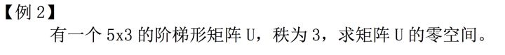

# 【第十三课】经典题型的解法

原文链接：[https://zhuanlan.zhihu.com/p/30494021](https://zhuanlan.zhihu.com/p/30494021)

## **0、前言**

MIT线性代数课程精细笔记\[第十二课\]笔记见[\[MIT十二课\]矩阵应用：图与网络](https://zhuanlan.zhihu.com/p/30261154)，该笔记是**连载**笔记，本文由坤博所写，希望对大家有帮助。

## **一、知识概要**

本节为习题课，主要回顾了下之前的学习内容，需要掌握经典题型的解法。

## **二、例题**

答案：

三个向量张开的空间，很明显维数只能是 0，1,2,3。本题中维数不可能是 0， 因为题设为非零向量。所以最后答案为：1,2,3。

答案：只有零向量

分析本题：

由秩为 3 可知原矩阵的列向量线性无关，也就是没有线性组合能得到零向 量，所以其零空间中只有零向量。

## **五.学习感悟**

这节复习结束，我们线性代数这一部分基础也结束了，接下来的课程会围绕正 交，特征值等概念展开讨论。

