# 【第十五课】子空间投影

原文链接：[https://zhuanlan.zhihu.com/p/30515493](https://zhuanlan.zhihu.com/p/30515493)

## **0、前言**

MIT线性代数课程精细笔记\[第十四课\]笔记见[【MIT线代十四课笔记】-正交向量与子空间](https://zhuanlan.zhihu.com/p/30515094)！，该笔记是**连载**笔记，本文由坤博所写，希望对大家有帮助。

## **一、知识概要**

这一节主要在讲解投影，从向量的投影入手，延伸到高维投影，并将投影用矩 阵形式给出，上一节中我们介绍了正交的基本概念，这一节中我们需要使用这个 概念，做投影即是向另一个向量上做垂线。通过本节的学习，我们可以更好的理 解正交概念以及空间之间的投影概念。

## **二．投影**

**2.1 简单的投影**

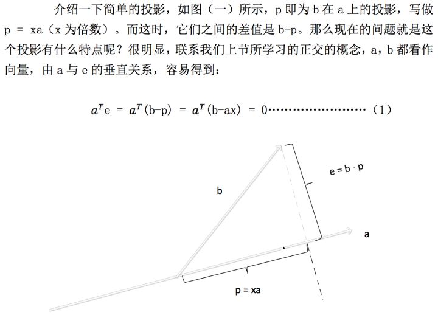

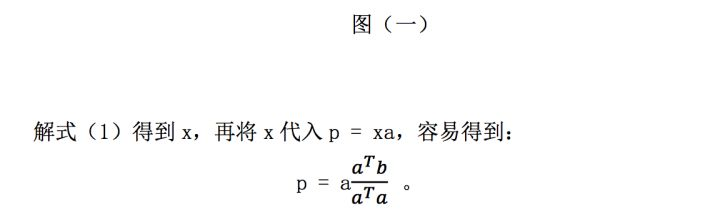

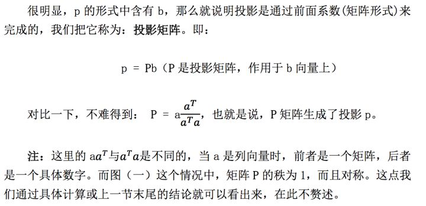

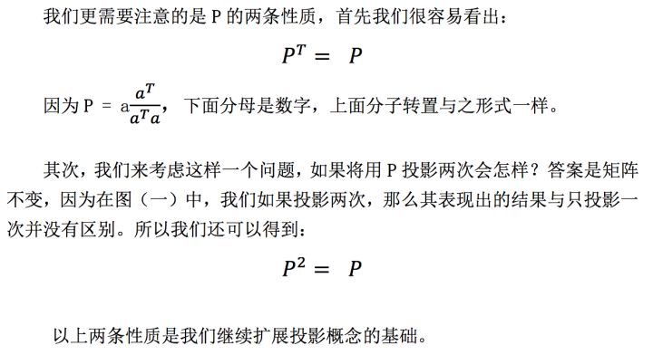

**2.2 平面上的投影**

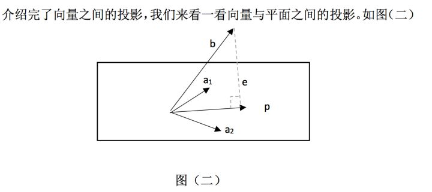

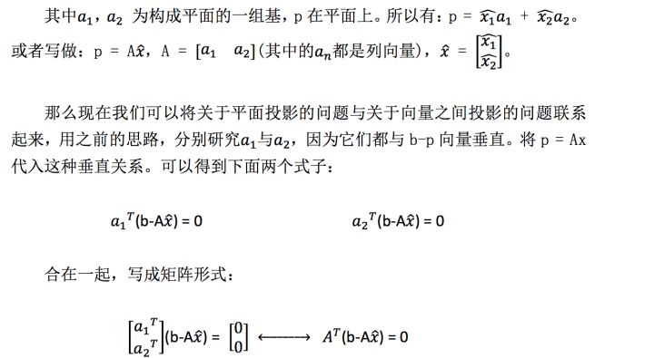

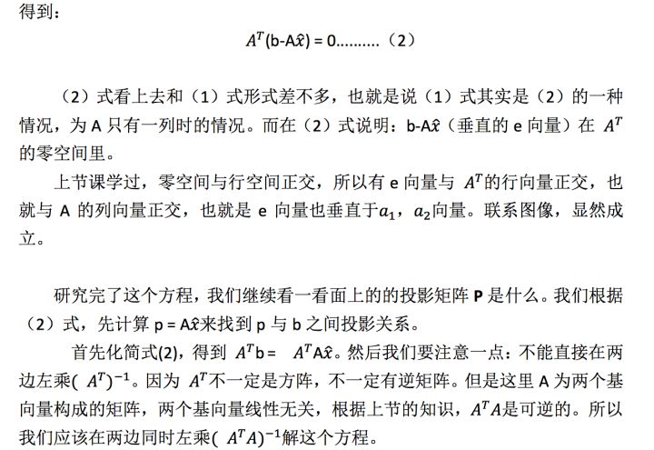

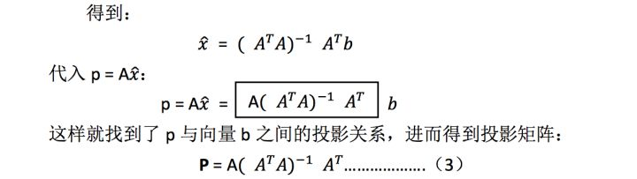

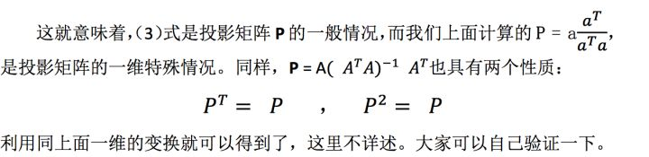

## **三、最小二乘法初涉**

那么我们之前学习的投影有什么用呢？我们不难发现，上面求得投影中的 e 是 可以看做 b 与 a 之间偏移量的大小。这样就为我们使用最小二乘法拟合直线提供 了方便。

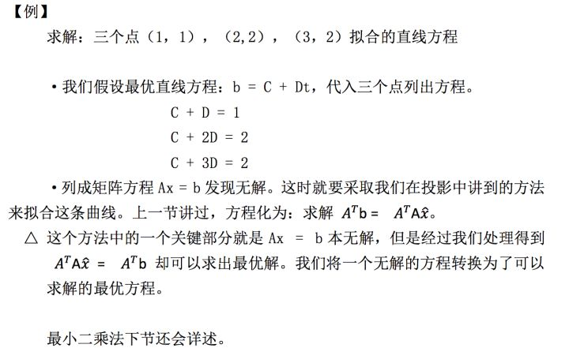

## **四、学习感悟**

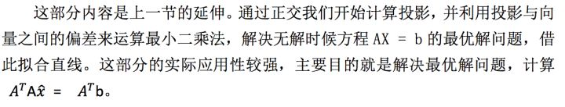

