# 【第十六课】投影矩阵和最小二乘

原文链接：[https://zhuanlan.zhihu.com/p/30809762](https://zhuanlan.zhihu.com/p/30809762)

## **0、前言**

MIT线性代数课程精细笔记\[第十五课\]笔记见[【MIT线代十五课笔记】-子空间投影](https://zhuanlan.zhihu.com/p/30515493)，该笔记是**连载**笔记，本文由坤博所写，希望对大家有帮助。

## **一、知识概要**

这一节主要在讲最小二乘法，并对上一节中的投影概念进行了深入研究，其实 最小二乘法就是一种投影，最后保证了误差最小。另外，这里还牵涉到了矩阵列 空间与矩阵左零空间的问题，向量的投影其实就是投在列空间中的最近一点，这 也与最小二乘法联系了起来。最后引申了标准正交向量组的问题。

## **二、投影矩阵回顾**

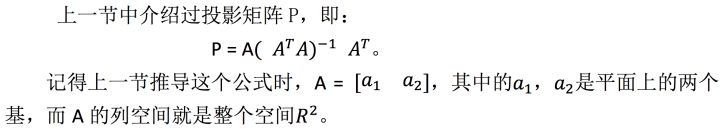

所以，投影矩阵 P 与一向量 b 的乘积可以理解为：将 b 向量投影到它在列 空间中的最近一点上，类似于上节课中，将 p 投影到平面上的过程。

那么这样两个问题的答案就很明显了：

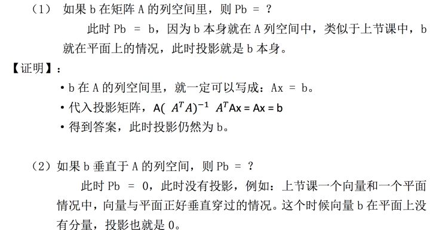

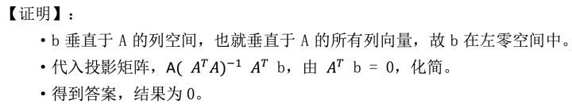

通过上面两个问题，我们可以看出来，一个向量 b 总有两个分量，一个分量 在 A 的列空间中，另一个分量垂直于 A 的列空间。而投影矩阵的作用就是保留列 空间中的那个分量，拿掉垂直于列空间的分量。

可以通过一幅图来表示这个关系：

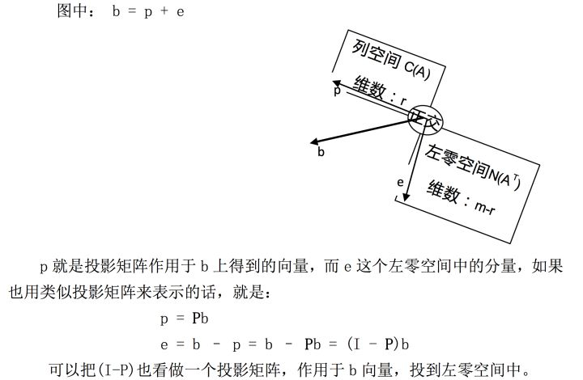

## **三、最小二乘法**

**3.1 最小二乘解题**

还是上节课的例子，这节中我们继续探讨。

【例】

求解：三个点（1，1），（2,2），（3，2）拟合的直线方程

讲解：

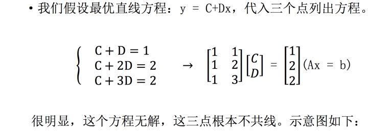

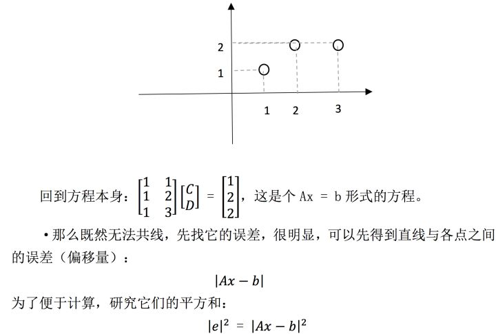

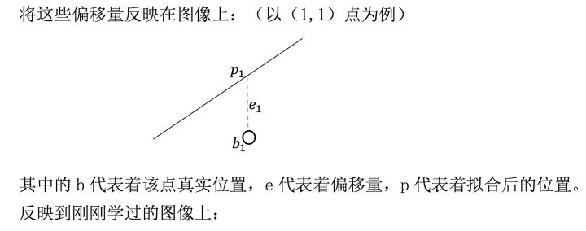

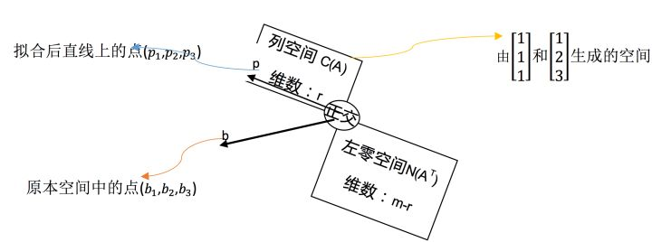

本质就是将 b 投影到 A 列空间中，用还记得上面说过，投影意义是将 b 向 量投影到它在列空间中的最近一点上。也就是说，这个过程是将三个点投到满足 方程条件的最近的一条直线上去。

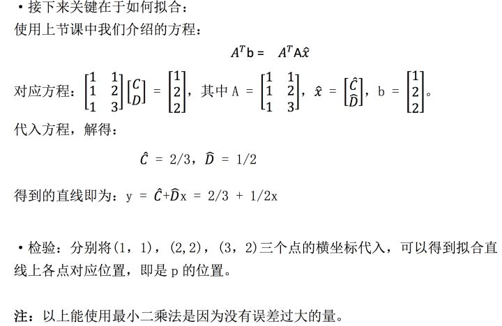

**3.2 性质讨论**

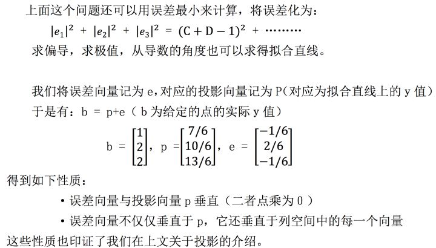

**3.3 结论证明**

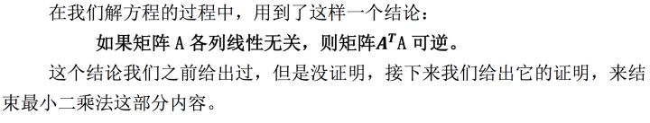

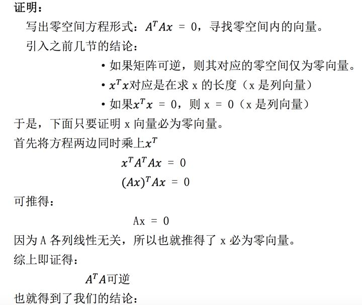

## **四、标准正交基**

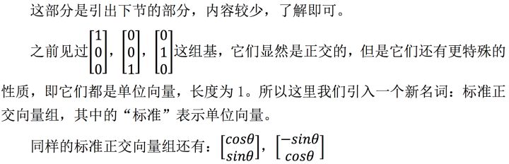

## **五.学习感悟**

这部分内容互相关联较多，最小二乘法与投影矩阵两者有着千丝万缕的联系， 可以从多个角度来理解，但是最重要的还是记住那张将向量投影到列空间与左零 空间的图，它能帮我们将这部分知识记得更牢。

  

