# 【第十七课】正交矩阵和Gram-Schmidt正交化

原文链接：[https://zhuanlan.zhihu.com/p/30954790](https://zhuanlan.zhihu.com/p/30954790)

## **0、前言**

MIT线性代数课程精细笔记\[第十六课\]笔记见，[投影矩阵和最小二乘-\[MIT线代第16讲笔记\]](https://zhuanlan.zhihu.com/p/30809762)，该笔记是**连载**笔记，本文由坤博所写，希望对大家有帮助。

## **一、知识概要**

这一节从上一节结尾介绍的标准正交向量谈起，主要介绍标准正交向量组的 性质与优点，以及将一组向量化为标准正交向量组的方法:Gram-Schmidt 正交化。

## **二、标准正交向量**

**2.1 回顾标准正交向量**

上节介绍过标准正交向量，我们通过一个式子进行回顾。

设 q 是标准正交向量组中的任意向量，则

这很好地表现了标准正交向量组内各向量的性质。“标准”→ 长度为 1。

## **2.2 标准正交矩阵 Q**

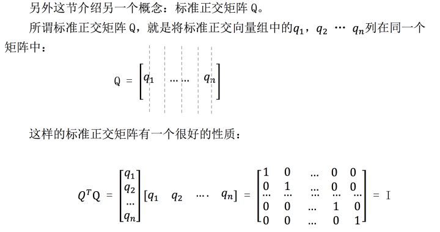

特别地，当 Q 是方阵时，我们将这样的矩阵 Q 称为：正交矩阵。

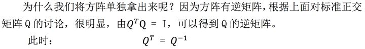

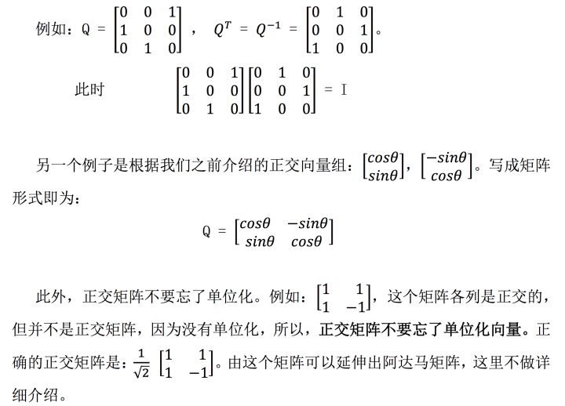

**2.3 标准正交矩阵的作用**

上面介绍了标准正交矩阵 Q 的各种性质，很显然这是一种新的性质优良的矩 阵，接下来主要介绍它的具体应用之一：投影矩阵。

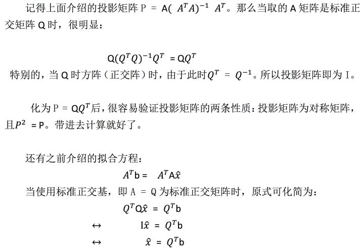

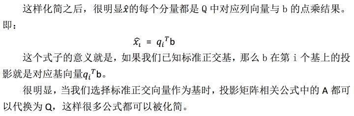

## **三、Gram-Schmidt 正交化**

这部分介绍一个方法，从线性无关向量组入手，将其矩阵标准正交化。

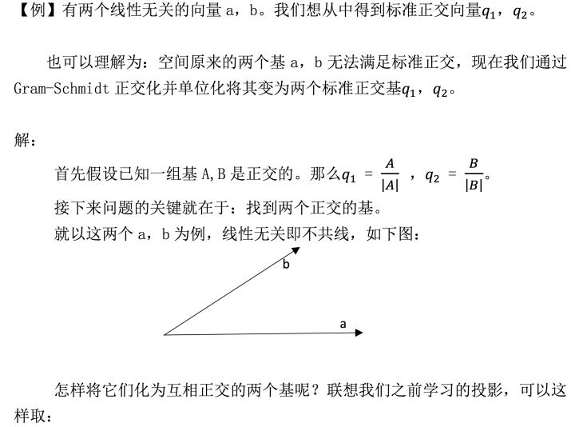

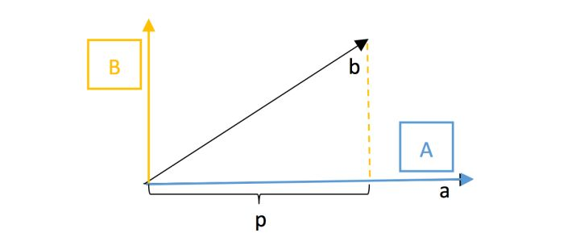

将 a 向量定为 A 向量，然后将 b 向量投影到 a 向量上。取投影垂线所在直线 的正方向为另一个基向量 B 的方向，取投影垂线长度为 B 的长度。这时 A 与 B 明 显正交。

上一节中学习过，这个 B 即为 \(b-p\)，联系之前 15 课学习的投影，不难得 到：

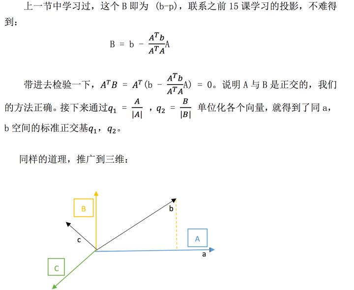

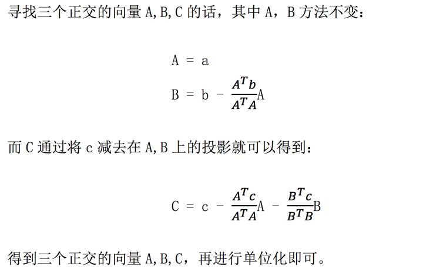

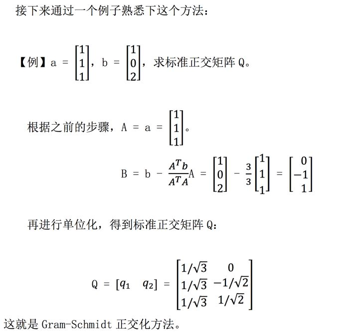

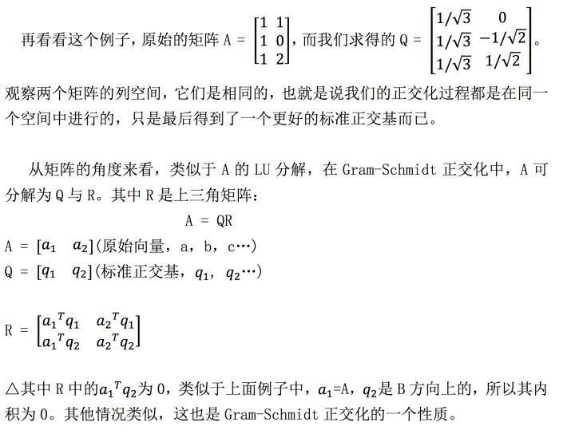

## **四、学习感悟**

这一节主要内容围绕 Gram-Schmidt 正交化，即将一个空间的基化为互相标 准正交的一组基，这样会方便我们的很多计算。这部分内容重在步骤，掌握其过 程方法为主要，需要一定的习题量来熟练。

