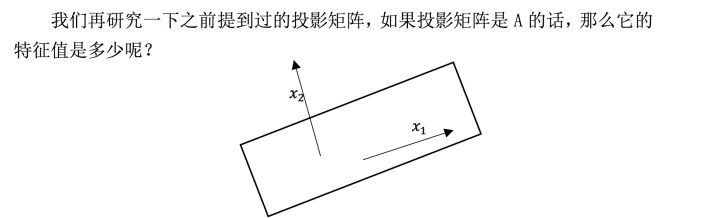
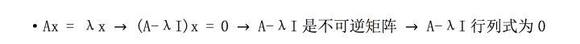
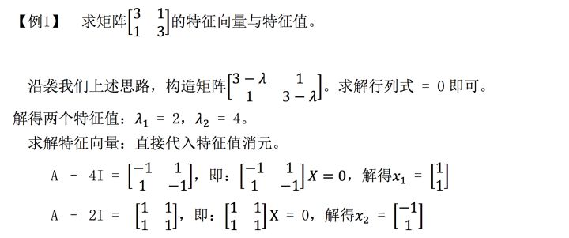
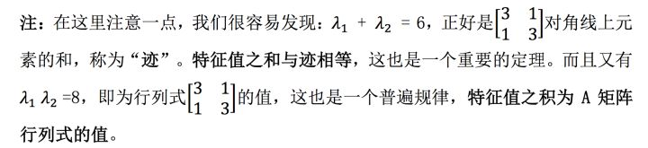
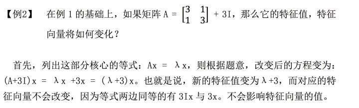
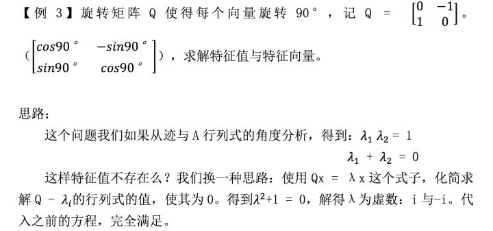
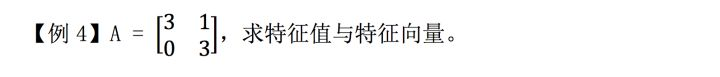

# 【第二十一课】 特征值和特征向量

原文链接：[https://zhuanlan.zhihu.com/p/33205535](https://zhuanlan.zhihu.com/p/33205535)

## **0、前言**

MIT线性代数课程精细笔记\[第二十课\]笔记见

[忆臻：克莱姆法则、逆矩阵、体积\[MIT线代第二十课\]​zhuanlan.zhihu.com](https://zhuanlan.zhihu.com/p/32035771)

该笔记是**连载**笔记，本文由坤博所写，希望对大家有帮助。

## **一、知识概要**

本节课讨论了特征值与特征向量。主要目的是掌握求特征值的技巧并对一些特 别的情况进行说明。本节内容比较基础。

## **二．特征值与特征向量**

**2.1 释义**

首先给出特征值与特征向量的定义：对矩阵 A，若有

则 x 为矩阵 A 的特征向量，λ为矩阵的特征值。那么如何理解特征值与特征向量 所代表的意义呢？

我们来看 Ax 这个式子，对于不同的向量 x，Ax 这个式子像是一个函数，输 入一个向量 x，则输出一个向量 Ax。而在我们输入的众多向量 x 生成的 Ax 中， 会有这样的向量 Ax，它们平行于 x，我们即用上面这个式子：  来表示 这个关系。

特别注意下特征值为 0 的情况。此时会有：AX = 0。我们可以发现 A 如果是 不可逆矩阵，则正好满足此性质。

1. 如果对任意平面上的 
   
    来说，投影矩阵根本不会影响它的大小所以就有： 
   
    恒成立。此时得到一个 
   
    为1
2. 如果对任意平面上的 
   
    来说，投影矩阵作用在此向量之后始终会有： 
   
    恒成立。如此即得到第二个 
   
    为0

**2.2 求解方法**

接下来我们给出特征值，特征向量的一般求解方法。我们对方程进行一些处理：

如上即为求解特征值的步骤。n 阶一共应该有 n 个特征值。

求解特征向量只需要取求解出的一个特征值λ，此时 A-λI 是一个不可逆矩 阵，利用\(A-λI\)X = 0 求解零空间中的向量即为矩阵的特征向量。

**2.3 特殊情况说明**

我们通过两个例题说明下这部分求解中可能遇到的特殊情况。

启示：我们发现 Q 是反对称矩阵（  ），而我们之前求的都是对称矩阵的 特征值，也就是说，对称矩阵的特征值为实数，而反对称矩阵的特征值为虚数， 这是两个极端。

思路:

这是个上三角矩阵，求解 A-λI 行列式时会发现，  ，这时的 特征向量只会有一个，也就是说，三角矩阵的结构的特殊性导致了其行列式为对 角线上元素，而如果对角线上两个元素相等，那么就会造成特征向量短缺情况。

## **三、学习感悟**

本节内容不是很困难，重点在于特征值与特征向量的求解，其实只要使用 A- λx 求解就没错，特别注意一下虚数情况就好了。重点是理解特征值如何求解以 及特征值到底代表着什么。

