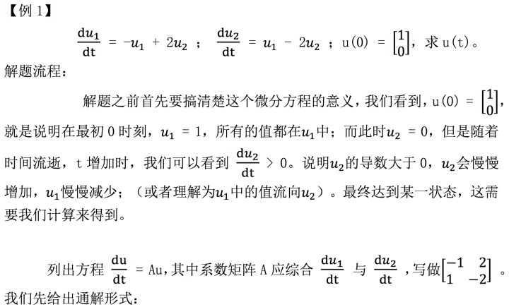
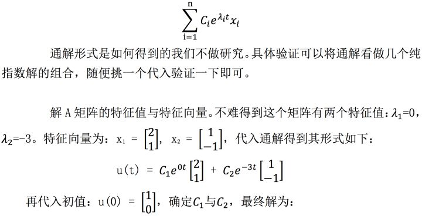
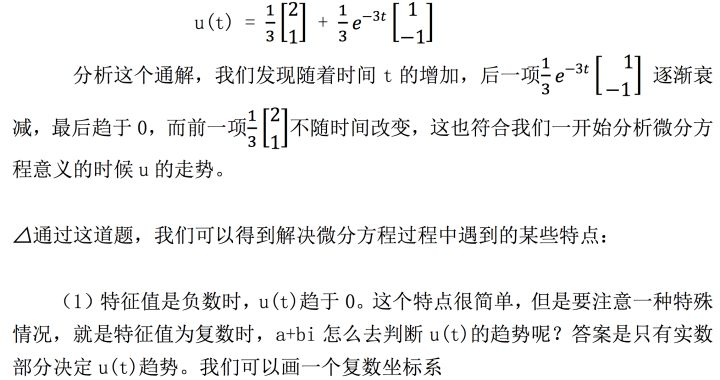
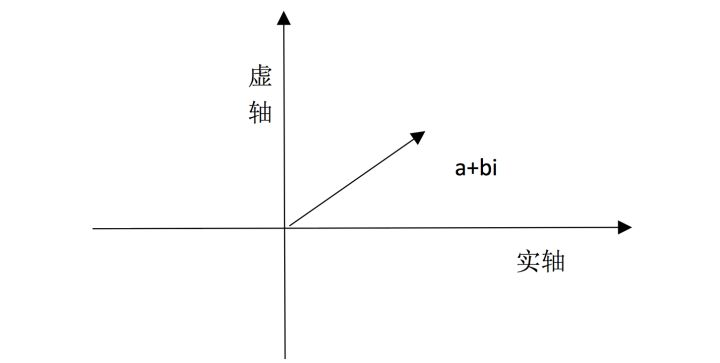
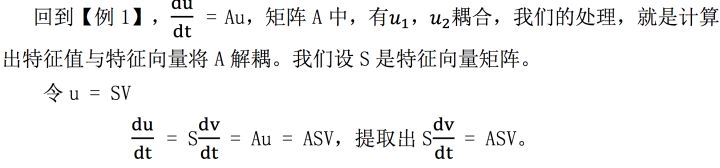
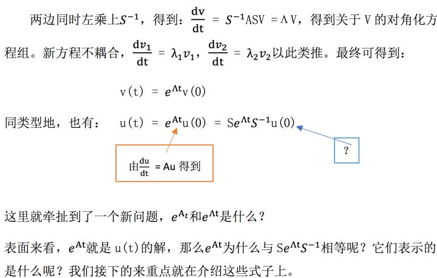
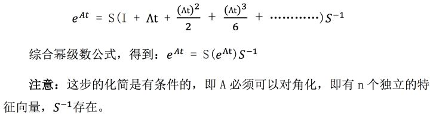
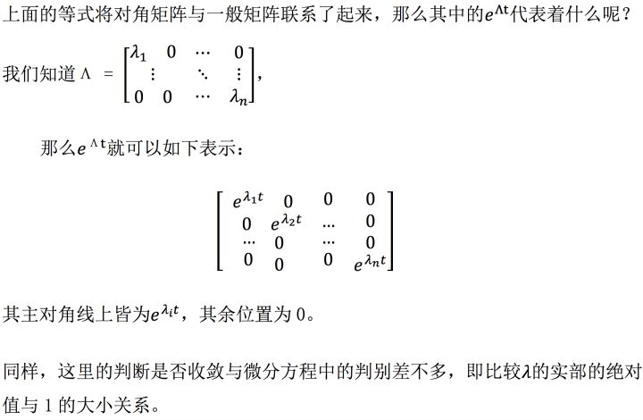
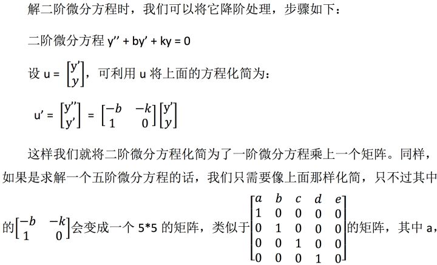

# 【第二十三课】微分方程和exp\(At\)

原文链接：[https://zhuanlan.zhihu.com/p/33867542](https://zhuanlan.zhihu.com/p/33867542)

## **0、前言**

MIT线性代数课程精细笔记\[第二十二课\]笔记见

[https://zhuanlan.zhihu.com/p/33295067​zhuanlan.zhihu.com](https://zhuanlan.zhihu.com/p/33295067)

该笔记是**连载**笔记，本文由坤博所写，希望对大家有帮助。

## **一、知识概要**

本节介绍一阶线性常微分方程的矩阵解法，也就是将微分方程用矩阵抽象，通 过“解耦”，计算出对应系数，最终得到解。这里会牵涉到𝑒 𝐴𝑥 计算问题， \(A 是 矩阵\)，所以也会引出幂指数是矩阵时算式的计算问题。最后扩展介绍了高阶微 分方程的降阶求解方法。

## **二．解微分方程**

**解决微分方程问题重点在于其流程，我们通过一道例题来介绍本部分内容。**

不难看出，投影到实数轴，只有实数部分 a 决定正负性，而虚部 b 的作用是 在另一条轴上指明方向，所以不影响我们的判断。

（2）稳态存在时（如【例 1】中最后 t 趋于无穷时，u 趋于一个确数），一个 特征向量=0，其余的特征向量全部&lt;0。

（3）如果有任何特征值实数部分&gt;0，则解无法收敛。

三．解耦与 

**3.1 解耦**

**3.3 矩阵指数**

## **四．二阶微分方程的解**

b，c，d，e 都是方程中的系数，而且主对角线上的元素下的元素都是 0。这样

的矩阵将五阶微分方程转化为一阶向量方程。接下来只要使用一阶微分方程正

常求解就可以了。

## **五、学习感悟**

本节内容较多，主要目的是在实际情况下使用矩阵对角化，特征值等方法求 解微分方程，给出了一种使用矩阵求解微分方程的通用规律，即高阶降阶，一阶 用特征值和特征向量将原系数矩阵 A 解耦，最后得到结果。并介绍了在我们解耦 A 时使用矩阵对角化将其与特征向量联系起来运算的方法。另外介绍了判断收敛 性的方法，即看特征值实部绝对值与 1 的大小关系。这些内容都是特征值与特征 向量的实际应用，较为重要。

