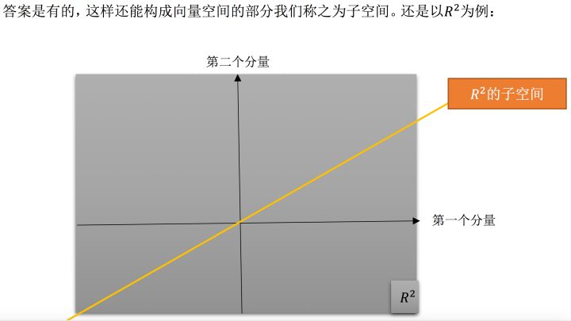

# 【第五课】转置-置换-向量空间R

原文链接：[https://zhuanlan.zhihu.com/p/28863518](https://zhuanlan.zhihu.com/p/28863518)

## **0、前言**

MIT线性代数课程精细笔记\[第四课\]笔记见[MIT线性代数课程精细笔记\[第四课\]](https://zhuanlan.zhihu.com/p/28490221)该笔记是**连载**笔记，本文由坤博所写，希望对大家有帮助。

## **一、知识概要**

本节我们再谈置换矩阵与转置矩阵，并介绍对称阵。之后便进入学习线代的关 键所在：向量空间与子空间。

## **二、置换矩阵**

**2.1 置换矩阵回顾**

所谓的置换矩阵 P，就是用来完成行交换的矩阵，更具体来讲，是行重新排列 了的单位矩阵。例如 I 就是一个置换矩阵，只不过 I 对矩阵没影响。

那么对于 n 阶矩阵来说，有多少个置换矩阵呢？答案是：n!种，也就是将单 位矩阵 I 各行重新排列后所有可能的情况数量。

  

**2.2 置换矩阵的使用**

在讲消元法的时候，主元位置为 0 是一件很让人头疼的事情，这时就需要置 换矩阵 P 来完成行交换，确保消元过程顺利进行。上节课学习 A = LU 分解时， 我们没有考虑要交换行的过程，如果我们想写出更普适的 LU 分解式的话，必须 把行交换情况考虑进去，即：

PA = LU

先用行交换使得主元位置不为 0，行顺序正确。其后再用 LU 分解。

## **三.转置矩阵**

**3.1 转置矩阵回顾**

之前简单介绍过转置矩阵，即

  

**3.2 对称阵**

对称矩阵，顾名思义，就是主对角线两侧元素对应相等的矩阵。或者说，对 矩阵 A，如果有：

## **四、向量空间与子空间**

**4.1 向量空间**

首先明确“向量空间”的概念，它表示一整个空间的向量，但是要注意，不 是任意向量的集合都能被称为向量空间。所谓的向量空间，必须满足一定规则， 就是：该空间对线性运算（相加，数乘）封闭。类似：v → 3v 或 v，w → v+w 运算，若得到的 3v 或者 v+w 都仍然在此空间中，那么这个空间可称为向量空间。

  

  

很明显，这部分空间无法满足“线性组合仍在空间中”的要求，比如数乘运算 时，随便取个负数，向量就跑到第三象限去，脱离 D 空间范围内了。

**4.2 子空间**

上面的反例已经证明了。在向量空间里随便取其一部分，很可能得到的不是 向量空间。那如果我们取向量空间的一部分，将其打乱，构成的有没有可能是向 量空间呢？

  

**4.3 列空间简要介绍**

上面介绍的子空间都是基于已知的图像来寻找的，接下来我们来通过具体的 矩阵来构造出一个子空间，比如：列向量构造出的列空间。

  

  

这里还要注意列向量之间的性质，如果列向量之间就是共线的，那么其列空 间就是一条过原点的直线。

## **五.学习感悟**

这节算是结束了之前部分对基本运算和基本概念的介绍。介绍了向量空间和 子空间，并由子空间引出了通过具体的列向量构成的空间—列空间。如何理解空 间十分重要，本节中对低维的空间做了图，目的主要是便于我们理解“空间”这 一概念。

