# 【第六课】列空间和零空间

原文链接：[https://zhuanlan.zhihu.com/p/29410442](https://zhuanlan.zhihu.com/p/29410442)

## **0、前言**

MIT线性代数课程精细笔记\[第四课\]笔记见[MIT线性代数课程精细笔记\[第五课\]](https://zhuanlan.zhihu.com/p/28863518)该笔记是**连载**笔记，本文由坤博所写，希望对大家有帮助。

## **一、知识概要**

本节从之前学习的子空间开始，介绍了子空间的部分性质。并重点介绍了列 空间与方程 Ax = b 之间的联系。并由此引出了零空间，根据 Ax = b 这个方程给 出了两种构建子空间的方法。

## **二．子空间**

**2.1 子空间回顾**

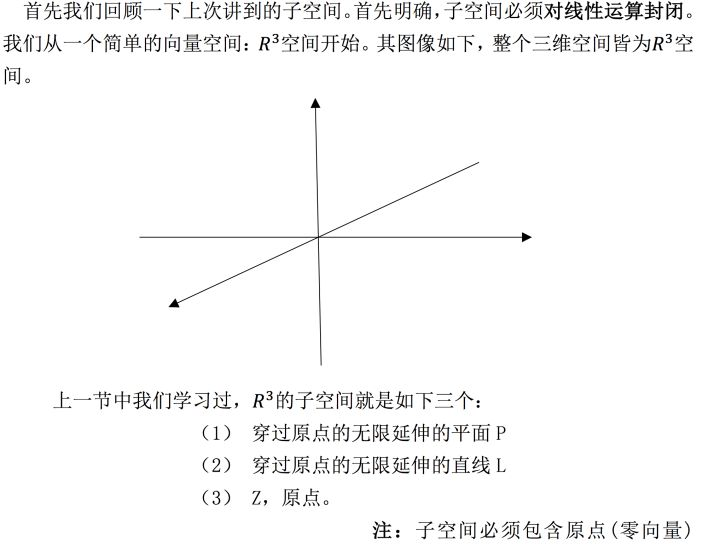

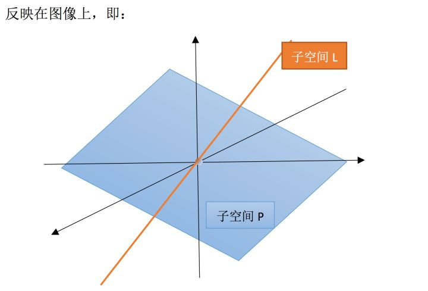

很明显，子空间直线 L 或平面 P 上，任取两个向量相加，得到的向量仍在该 子空间中。而且将其上的向量做数乘伸长或缩短一定倍数，其结果也还在该子空 间中。所以它们都对线性运算封闭。

**2.2 子空间的“交”与“并”**

上面我们都是分别研究的两个子空间，那么接下来我们对两个空间之间联系 部分展开讨论

**2.2.1 P∪L 空间**

还是讨论上面𝑅 3 的子空间 P 与 L，首先要研究的就是它们的并空间，即：现 有一集合，包含了 P 与 L 中的所有向量，那么这个集合是子空间吗？

答案是否定的。

很明显，我们将直线 L 与平面 P 看做同一个集合 P∪L 之后,这个集合对线性 运算并不封闭。比如我们随便在直线 L 上取一个向量 a，在平面 P 上取一个向量 b。此时向量 a+b 方向就会夹在直线 L 与平面 P 之间，脱离了 P∪L 的范围。所以 P∪L 无法构成空间。

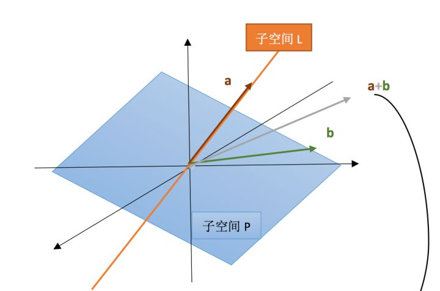

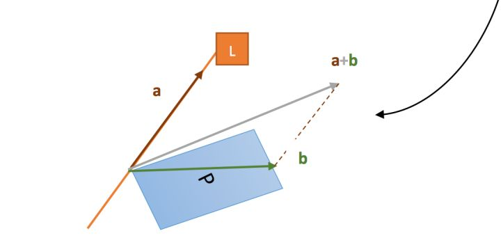

**2.2.2 P∩L 空间**

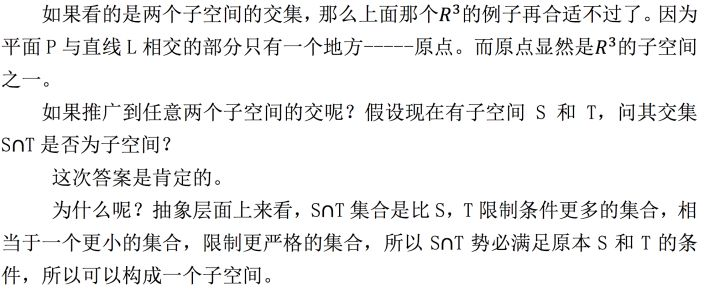

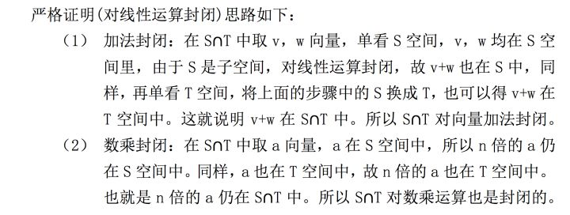

## **三.列空间**

**3.1 列空间回顾**

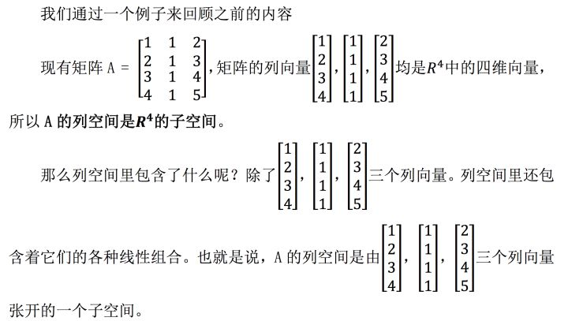

那么这个子空间有多大呢？这就需要用 Ax = b 方程来解释了。

**3.2 Ax = b 的空间解释\(从 A 的角度\)**

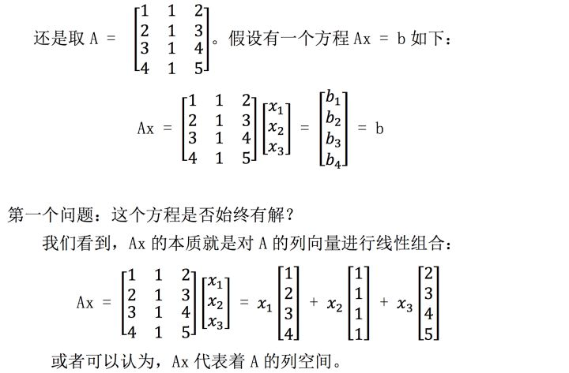

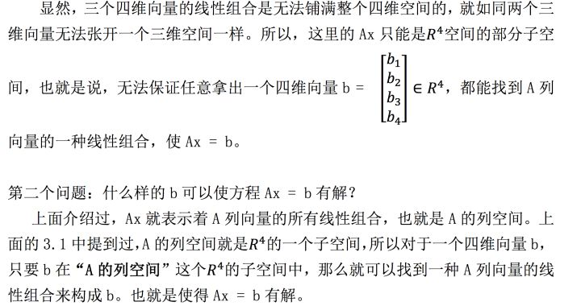

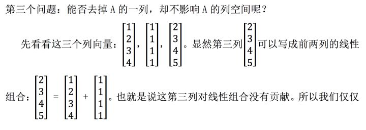

## **四、零空间**

**4.1 零空间介绍**

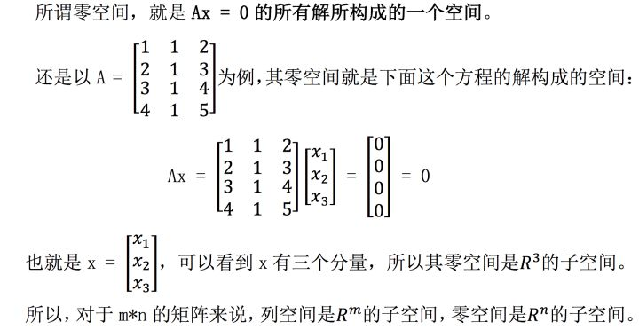

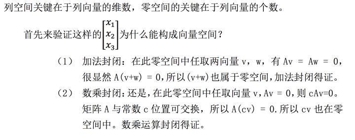

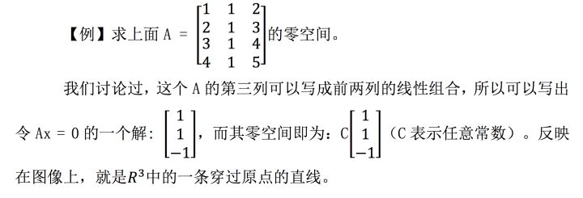

**4.2 Ax = b 的空间解释\(从 x 的角度\)**

那如果上面构造零空间的方程右侧变为任意向量的话，其解集 x 还能构成 向量空间吗？

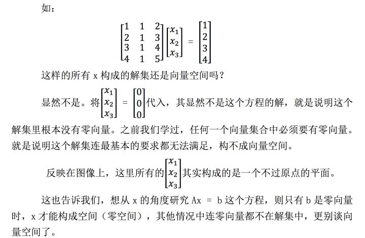

## **五.学习感悟**

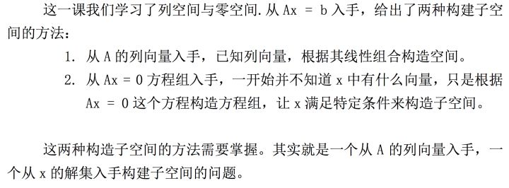

  

