# 【第九课】线性相关性、基、维数

原文链接：[https://zhuanlan.zhihu.com/p/29903948](https://zhuanlan.zhihu.com/p/29903948)

## **0、前言**

MIT线性代数课程精细笔记\[第二课\]笔记见[MIT线性代数课程精细笔记\[第八课\]](https://zhuanlan.zhihu.com/p/29734799)，该笔记是**连载**笔记，本文由坤博所写，希望对大家有帮助。

## **一、知识概要**

之前消元处理矩阵时，经常发现矩阵中有时会有一行或几行本身就是前面几 行的线性组合情况，这一节我们就从这种线性相关或线性无关的特征入手，介绍 空间中的几个重要的概念：基，维数。

## **二、线性无关与线性相关**

**2.1 背景知识**

首先强调，接下来我们谈论的概念都是基于向量组的，而不是基于矩阵。线 性无关，线性相关是向量组内的关系，基也是一个向量组，不要与矩阵概念混淆。

首先从之前学习的 Ax = 0 方程谈起。

假设 m\*n 的矩阵 A：

显然，n &gt; m，以这样的矩阵 A 构成的方程 Ax = 0，此时未知数𝑥 𝑛 的个数比 方程的个数多。未知数一共 n 个，方程一共 m 个。

所以此时 A 的零空间中除零向量以外还有其他向量，原因是这样的 A 一定有 自由变量\(至少有 n-m 个自由变量\)，这就造成了零空间中向量的无穷解。

**2.2 线性无关与线性相关**

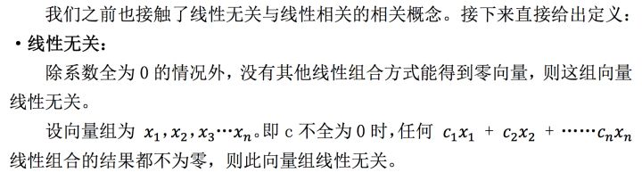

举几个例子感受一下上面的概念：

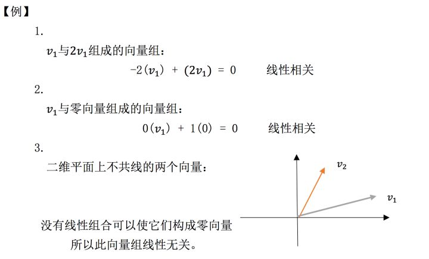

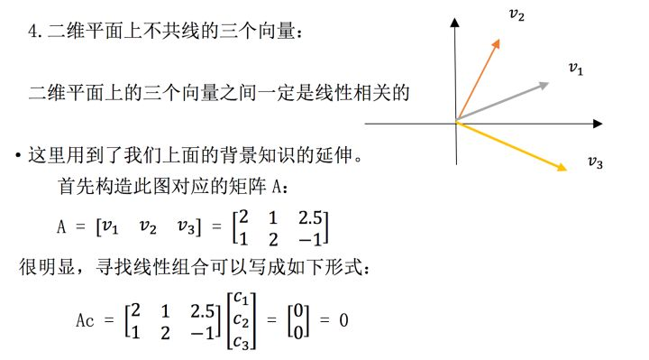

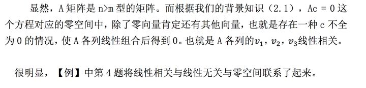

**2.3 零空间的作用**

根据上面的例题 4，我们再从矩阵的零空间与矩阵列向量角度重新定义 向量组的线性相关/无关。假设现有一 m\*n 矩阵 A：

·如果 A 各列向量构成的向量组是线性无关的，那么矩阵 A 的零空间中只有零 向量。

·如果 A 各列向量构成的向量组是线性相关的，那么矩阵 A 零空间中除零向 量之外还一定有其他向量。

很好理解上面零空间角度的定义。因为零空间反映的就是 A 各列向量的线性 组合。

  

**从秩的角度看来：**

·线性无关对应向量组构成的矩阵，秩为 n，此时没有自由变量，零空间中 只有零向量存在。

·线性相关对应向量组构成的矩阵，秩小于 n，有 n-r 个自由变量，零空间 中有很多向量。

**2.4 生成空间**

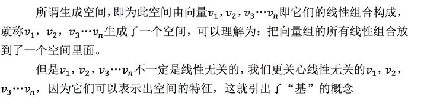

## **三、基**

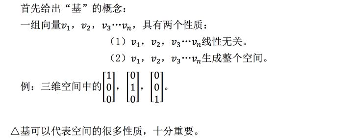

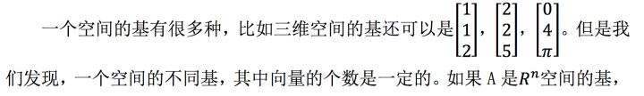

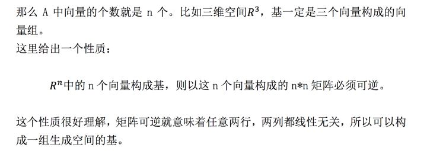

## **四.维数**

上面介绍基的时候提到了“𝑅 𝑛 空间的基中向量个数为 n 个。”这个“n”我 们称之为维数。同一个空间内，即使基不同，基向量的个数也必须相等。

理解维数也很简单，像我们的三维空间，其基一定是三个三维向量（三个 向量，每个向量有三个分量），四维空间的基也一定是四个四维向量。

## **五.总结**

这一节学习了很多概念问题，我们通过一道例题回顾一下

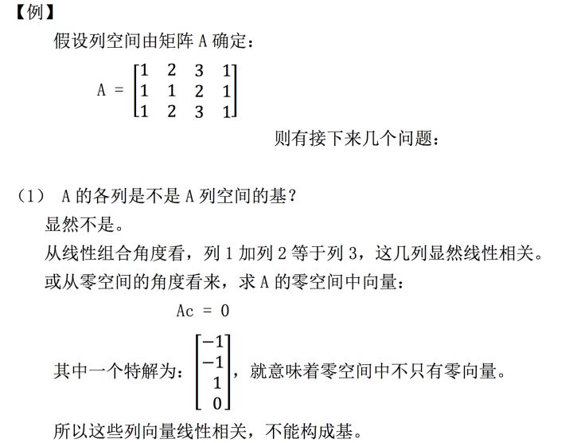

（2）找出A列空间的一个基

从 A 的结构看来：

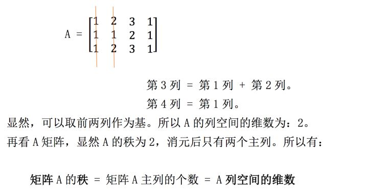

这下我们就将矩阵的秩与列空间的维数联系了起来，而更重要的是，我们知 道了列空间的维数，那么在这个列空间中随便找两个线性无关的向量，它们就可 以构成一组基，这组基就可以生成这个列空间。

（3\)A对应零空间的维数为多少？

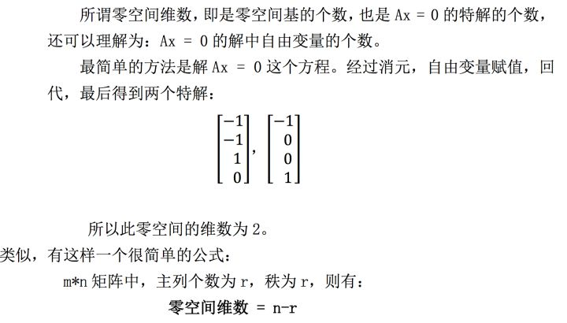

## **五.学习感悟**

这一节内容十分简单，就是几个概念的介绍：线性相关/无关，基，维数。这 一节这几个概念都是用来描述空间的，了解这几个概念之后，我们便将矩阵的秩， 矩阵的自由变量等概念与空间的维数，基，线性相关/无关的判定联系起来。便 于我们接下来对向量空间的研究。

